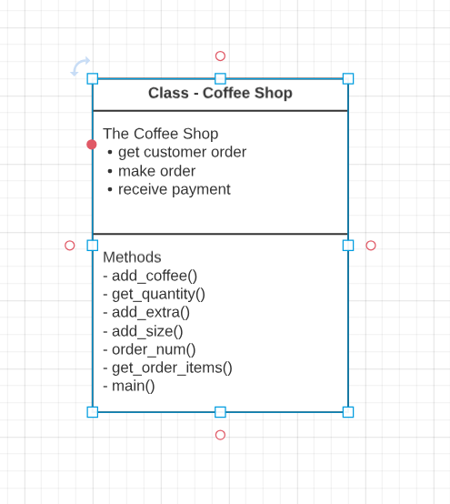

# **Cuppa Joe**

Welcome to Cuppa Joe

We provide wonderful aroma's and taste's of coffee's from all over the four corners of the world, that taste heavenly. In the quest to bring coffee lovers wanting more each time they visit us and having an experience like nowhere else.

This is the link to the live version of Cuppa Joe  [Here](https://cuppa-joe-0dbd4cd33d7f.herokuapp.com/)  

## How to Order
The system for ordering is very straight forward and easy to use
-

* Firstly, you are greeted by one of our lovely staff members.
* They will display the menu of our delicious coffee's.
* The user will then be asked a number of questions regarding ordering.
* The user will be asked what would you like to drink.
* The user inputs their choice from the menu.
* The waitress will asked how many coffee's do you require.
* The user inputs their numbers of coffee's.
* The waitress will ask would you like anything extra with your coffee.
* The user inputs their choice from the menu.
* The waitress will ask what size of coffee.
* The user inputs their choice from the menu.
* The waitress confirms your order.
* The waitress displays your order.
* The waitress displays the user with an order number.
* The waitress displays the user with a price of the order.

# Features

## Existing Features
1. First you 
2. 

## Future Features
- Its linked to google sheet - Cuppa Joe but the plan is to expand and store information about stock, sales etc. - [Cuppa Joe Google Sheet](https://docs.google.com/spreadsheets/d/1LndCzbR5Ka51pPy-31jOA-pqE0OtMWGdWG6E3wUtcwM/edit#gid=1040659719)
- Upgrade UI with background image
- Add Payment Section

# Data Model

**UML - Use Case Diagram**

Unified Modelling Language (UML) is used to give a visual breakdown of the process of the application.

* A use case diagram give the interaction between the user and the application.
* The system is represented by the box in the diagram. The figures outside the system represents the user interacting with the system.
* The circle present the actions within the system.
* The lines are the communication between the user and the system.

**Class Diagram**

The class diagram allow you to plan the development of the project on what methods need to be implemented to arrive with a working application. It allows your code to be structured in a set of instructions that the application can follow and apply by you the developer and operating system. 
We have created a class called Coffee Shop shown in the diagram below which the developer to implement each function as set of instruction to be carried out. This is called Object Oriented programming that allow the developer to map out the methods to be used to develop the project.

**Flow Control Diagram**

The flow control is a design in how a transaction follows a certain path with clear instructions called statements and functions to call and execute to reach a desired outcome by using statements like if elif else statements to whether the path you choose to reach the outcome of the user.This allows the user to validation the outcome in its coding of the application. 

# Libraries & Technology

Built-in Python Libraries

* Random 

    This was used to generate the random order number in the receipt at the end of the process.

* Tabulate

    This was used to create the display boxes for each from the menu items

Other Technologies

Resize Image
* [Resize Pixel](https://www.resizepixel.com/download)

ASCII Image

* [Ffsymbols](https://fsymbols.com/text-art/)
* [textart4u](https://textart4u.blogspot.com/2012/03/tea-cup-text-art-ascii-art.html)

# Testing

- Test 1

Test Y on the - Do you want to add to the order?

Steps to Test:

  1. Enter Y
  2. Click Submit
  3. Display Menu List

Expected:

  Y to bring you to the Menu list

Result:

  No errors and worked as expected.

- Test 2

Test N on the - Do you want to add to the order?

Steps to Test:

  1. Enter N
  2. Click Submit
  3. Exit you

Expected:

  N to bring you to the exit

Result:

  No errors and worked as expected.
  
Test 3

Enter your coffee choice

Steps to Test:

  1. Enter coffee from menu
  2. Click submit.
  3. Display quantity section
  
Expected:
  Display quantity section
  
Result:
  No errors and worked as expected.

Test 4
Enter your coffee choice wrongly

Steps to Test:

  1. Enter input
  2. Click submit.
  3. Display Error
  4. Resubmit Correct input
  5. Display quantity
  
Expected:
  Display quantity section
  
Result:
  No errors and worked as expected.

Test 5

 Enter quantity

Steps to Test:

  1. Display quantity.
  2. Enter value
  3. Click submit.
  4. Display extra section
   
Expected:

 Display extra section

Result:

  No errors and worked as expected.

Test 6

 Enter quantity wrongly

Steps to Test:

  1. Display quantity.
  2. Enter value
  3. Display Error
  4. Resubmit Correct input
  5. Display extra section
   
Expected:

 Display extra section

Result:

  No errors and worked as expected.

Test 7

 Enter extra

Steps to Test:

  1. Display extra.
  2. Enter value
  3. Click submit.
  4. Display size section
   
Expected:

 Display size section

Result:

  No errors and worked as expected.

Test 8

 Enter extra wrongly

Steps to Test:

  1. Display extra.
  2. Enter value
  3. Display Error
  4. Resubmit Correct input
  5. Display size section
   
Expected:

 Display extra section

Result:

  No errors and worked as expected.

Test 9

 Enter size

Steps to Test:

  1. Display size.
  2. Enter value
  3. Click submit.
  4. Display exit or add order question
   
Expected:

 Display exit or add order question

Result:

  No errors and worked as expected.

Test 10

 Enter size wrongly

Steps to Test:

  1. Display size.
  2. Enter value
  3. Display Error
  4. Resubmit Correct input
  5. Display extra section
   
Expected:

Display exit or add order question

Result:

 Failed - Loop won't break out 

- Test 11

Test Y on the - Do you want to add to the order?

Steps to Test:

  1. Enter Y
  2. Click Submit
  3. Display menu list again

Expected:

  Y to bring you to the Menu list

Result:

  No errors and worked as expected.

- Test 12

Test N on the - Do you want to add to the order?

Steps to Test:

  1. Enter N
  2. Click Submit
  3. Display your order

Expected:

 Display your order

Result:

  No errors and worked as expected.
 

## Bugs
### Solved Bugs
- 
- 
- 

## Remaining Bugs
- 
- 
- 

## Validator Testing
PEP8
- [PEP8 online](https://pep8ci.herokuapp.com/) is used to validate the python file and to check if there is any errors that need to be fixed.

# Deployment

The project used CodeAnywhere is its code editor to develop the Cuppa Joe Application [CodeAnyWhere](https://firefox35-cuppa-joe-awilov8vp9.us2.codeanyapp.com/#/workspaces/cuppa-joe)

The site was deployed via [Heroku]( https://id.heroku.com/login), and the live link can be found here: [Cuppa Joe](https://cuppa-joe-0dbd4cd33d7f.herokuapp.com/)  

This project was developed utilising the [Code Institute Template]( https://github.com/Code-Institute-Org/python-essentials-template).  Some of the deployment steps below are specifically required for the new CI template and may not be applicable to older versions, or different projects.

Before deploying to Heroku pip3 freeze > requirements.txt was used to add Tubulate and Gspread imports for deployment.

1.	Log in to [Heroku]( https://id.heroku.com/login) or create an account if required.
2.	Then, click the button labelled **New** from the dashboard in the top right corner and from the drop-down menu select **Create New App**.
3.	You must enter a unique app name.
4.	Next, select your region, (I chose Europe as I am in Ireland).
5.	Click on the **Create App** button.
6.	The next page you will see is the project’s Deploy Tab.  Click on the **Settings Tab** and scroll down to **Config Vars**.
7.	Click **Reveal Config Vars** and enter **port** into the **Key** box and **8000** into the **Value** box and click the **Add** button.
8.	Next, scroll down to the Buildpack section click **Add Buildpack** select **python** and click **Save Changes**.
9.	Repeat step 8 to add **node.js**.
	**Note:** The Buildpacks must be in the correct order. If not click and drag them to move into the correct order.
10.	Scroll to the top of the page and now choose the **Deploy** tab.
11.	Select **Github** as the deployment method.
12.	Confirm you want to connect to GitHub.
13.	Search for the repository name and click the connect button.
14.	Scroll to the bottom of the deploy page and select preferred deployment type:

* Click either **Enable Automatic Deploys** for automatic deployment when you push updates to Github.

* Select the correct branch for deployment from the drop-down menu and click **Deploy Branch** for manual deployment.

### Version Control
* Github was used as the version control software to store the project code. 
* The Git Commands used were git add . , git commit -m and git push to send it to the Github Repository -
  [Cuppa Joe Repo](https://github.com/firefox35/cuppa-joe)

# Credits
## Reading Material

* Python Program to Generate a Random Number -- https://www.programiz.com/python-programming/examples/random-number

* Python random number between 1 and 100 -- https://pythonspot.com/random-numbers/

* Python Nested Dictionary -- https://www.geeksforgeeks.org/python-nested-dictionary/

* Python – Extract values of Particular Key in Nested Values -- https://www.geeksforgeeks.org/python-extract-values-of-particular-key-in-nested-values/

* Create a Dictionary in Python – Python Dict Methods -- https://www.freecodecamp.org/news/create-a-dictionary-in-python-python-dict-methods/

* Python Dictionary Comprehension Tutorial -- https://www.datacamp.com/tutorial/python-dictionary-comprehension

* How to Create a Dictionary in Python ( 3 Ways ) -- https://absentdata.com/python/how-to-create-a-dictionary-in-python-3-ways/

* Unreachable Code and Exhaustiveness Checking -- https://typing.readthedocs.io/en/latest/source/unreachable.html

* Simple but too many positional arguments for method call -- https://stackoverflow.com/questions/57641186/simple-but-too-many-positional-arguments-for-method-call 

* TypeError: can only concatenate str (not "set") to str -- https://stackoverflow.com/questions/56791883/typeerror-can-only-concatenate-str-not-set-to-str --

* TypeError: list indices must be integers or slices, not tuple -- https://itslinuxfoss.com/type-error-list-indices-must-integers-slices-tuple/#:~:text=The%20%E2%80%9Clist%20indices%20must%20be,list%20items%20causes%20a%20TypeError

* Python Try Except -- https://www.geeksforgeeks.org/python-try-except/

* Using a Function in Another Function | Python Tutorial for Beginners --
https://www.google.com/search?rlz=1C1CHBF_enIE1013IE1013&sxsrf=AB5stBhVhkBGF-Y0cC6GMiBvrM9VMV-XbA:1691420085665&q=how+to+use+one+function+in+another+function+in+python&tbm=vid&source=lnms&sa=X&sqi=2&ved=2ahUKEwjlzvzq5sqAAxUFR8AKHUoACdIQ0pQJegQICRAB&biw=1360&bih=651&dpr=1#fpstate=ive&vld=cid:62e8633b,vid:5WSPeLEvZ9c

* What is Python's Main Function Useful For? --
https://www.google.com/search?rlz=1C1CHBF_enIE1013IE1013&sxsrf=AB5stBgT9rqvOWnP_OJ6l3KX5ncZ2uU5aA:1691399218675&q=how+to+use+a+main+function+in+python&tbm=vid&source=lnms&sa=X&ved=2ahUKEwjMz-iMmcqAAxVJVkEAHTowD0wQ0pQJegQIDBAB&biw=1360&bih=651&dpr=1#fpstate=ive&vld=cid:3c80e14c,vid:lVUOrPunRxQ
 
## Video Material

- Python NameError: global name 'x' is not defined --
https://www.youtube.com/watch?v=miXTxmIHh8g

- Python: While Loop for Input Validation --
https://www.youtube.com/watch?v=eF5mObNHeek

- How to Validate User Inputs in Python | Input Validation in Python --
https://www.youtube.com/watch?v=LUWyA3m_-r0

- Python Programming: How to display the menu items and prices on the screen? --
https://www.youtube.com/watch?v=hkmc0vYGpHc

- How to Create a Menu in Python --
https://www.youtube.com/watch?v=P6azEyNIQDQ

- Python for beginners Coffee Shop program --
https://www.youtube.com/watch?v=CZi2xCFuWGI

- Make Menus In Python with While True Loop | Choose an Option in Python --
https://www.youtube.com/watch?v=ZBx7oWCJ4aY

- Funpy - Classic upper lower case problems in python --
https://www.youtube.com/watch?v=O4sexLv0Ovc

- 2020 How to Fix Your Path Variable in Python | Python Tutorial --
https://www.youtube.com/watch?v=3J96_vyfx8Y

- Introduction to Classes and Objects - Part 1 (Data Structures & Algorithms #3) --
https://www.youtube.com/watch?v=8yjkWGRlUmY

- TypeError: Missing 1 required positional argument: 'self' --
https://www.youtube.com/watch?v=uoLYZ2NzaSI

- KeyError Pandas: How to fix --
https://www.youtube.com/watch?v=6bQVZED9jwM

- Python program to Create class STORE to keep track of Products --
https://www.youtube.com/watch?v=WU2k1rzKZHU

- User Input and Exception Handling in Python --
https://www.youtube.com/watch?v=FH75gUctFvY

- Read and Write data from google sheets using python --
https://www.youtube.com/watch?v=hyUw-koO2DA

- How to Use Global Variables Inside a Python Function? --
https://www.youtube.com/watch?v=v2oLM6tDj04

